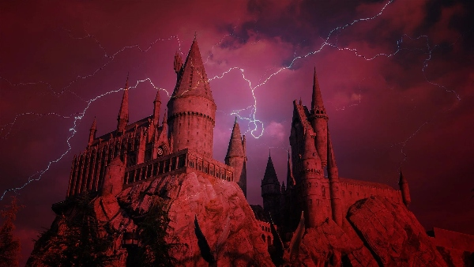

# The Convergence

You cast the spell correctly and Delaney's spirit soars high into the air. She disappears out of sight and you suddenly feel a rush through your entire body. Your mind is no longer connected to your own thoughts. 🧠

Delaney's wicked spell *merged her spirit into your body* and she is now fused with every part of you. 

You make the most out of Delaney's plethora of knowledge and use your new powers for anyone in your way. 💥

🎯 -20 points from Ravenclaw

