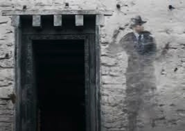

# The Curse

Although Delaney intrigues you, her plead is not enough. You've been taught to stay weary of spells you are not familiar with. 

You attempt to banish her spirit from haunting Hogwarts by casting a known spell.

However, your spell backfires 🎇- you become trapped by Delaney's protection she cast upon her self.

Delaney's presense spreads throughout Hogwarts 

🎯 -10 points from Ravenclaw

